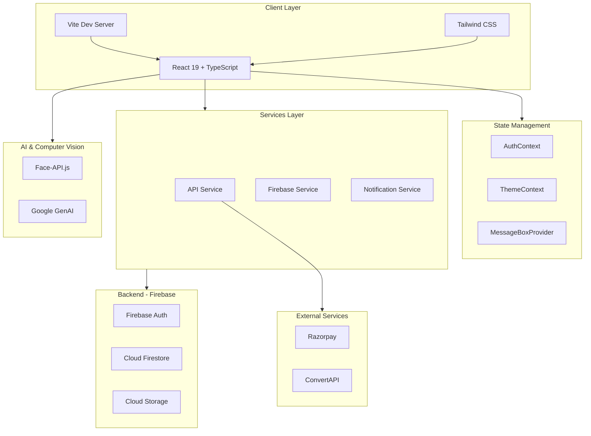
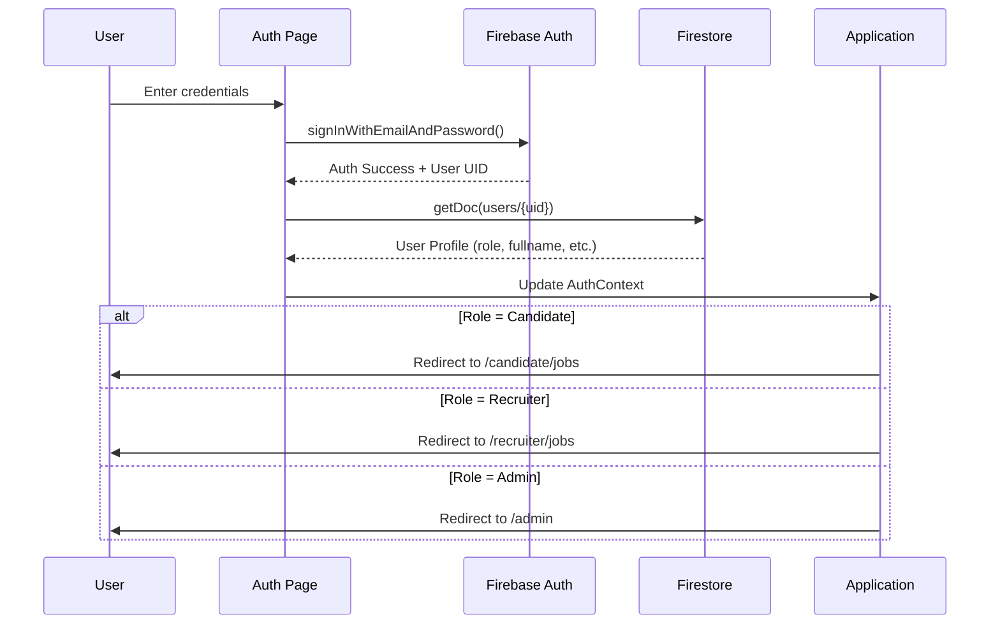
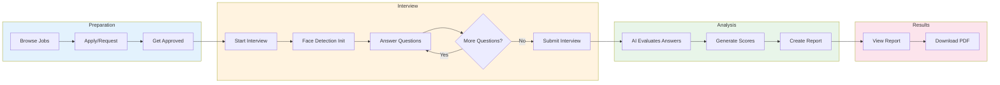
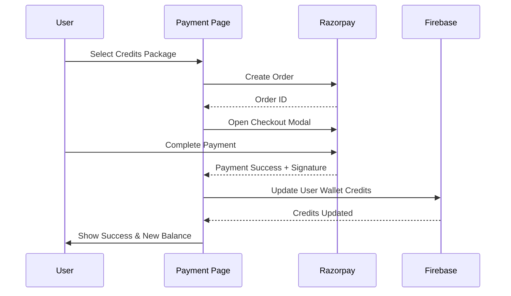
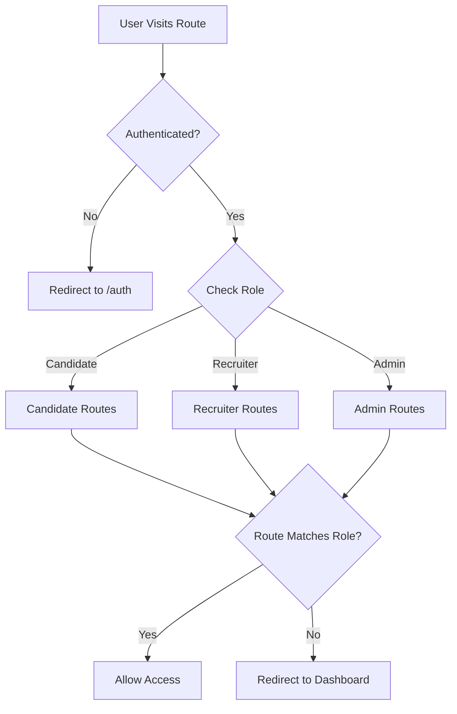
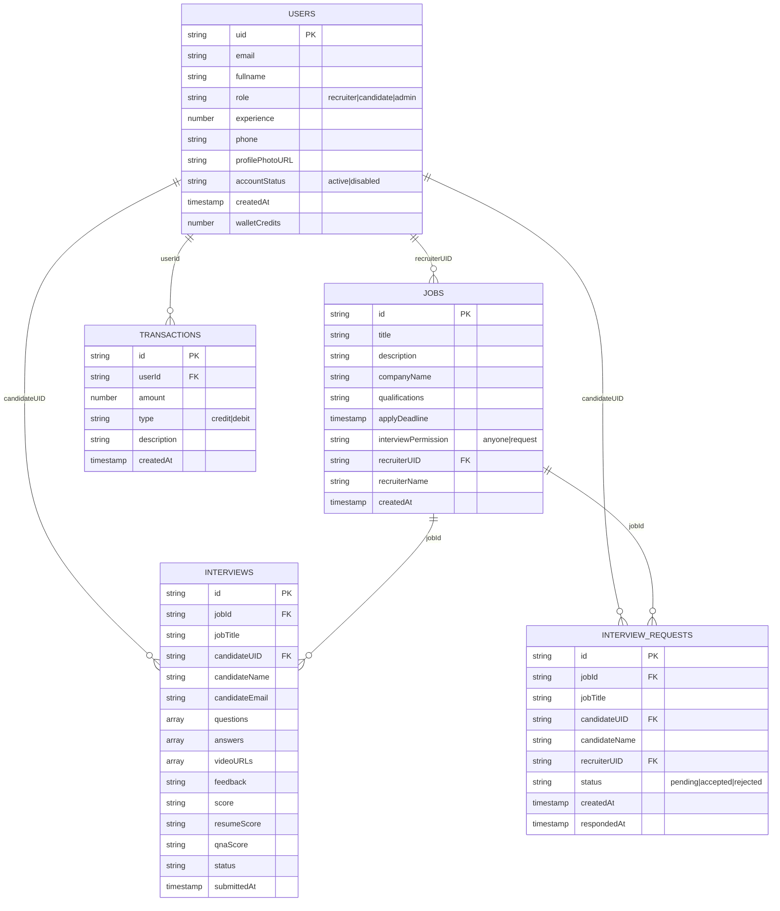

<div align="center">

# InterviewXpert

<picture>
  <source media="(prefers-color-scheme: dark)" srcset="https://i.ibb.co/3y9DKsB6/Yellow-and-Black-Illustrative-Education-Logo-1.png">
  <source media="(prefers-color-scheme: light)" srcset="https://i.ibb.co/3y9DKsB6/Yellow-and-Black-Illustrative-Education-Logo-1.png">
  
</picture>

### **Master Your Next Interview with AI-Powered Preparation**

[](https://react.dev/)
[](https://www.typescriptlang.org/)
[](https://firebase.google.com/)
[](https://vitejs.dev/)
[](LICENSE)

[Live Demo](#) • [Documentation](#table-of-contents) • [Report Bug](https://github.com/AaradhyaproK/interviewxpert-opencv/issues) • [Request Feature](https://github.com/AaradhyaproK/interviewxpert-opencv/issues)

---

</div>

## Table of Contents

<details open>
<summary><b>Click to expand/collapse</b></summary>

- [Overview](#overview)
- [Key Features](#key-features)
- [System Architecture](#system-architecture)
- [Project Structure](#project-structure)
- [Application Flow](#application-flow)
- [Tech Stack](#tech-stack)
- [Installation](#installation)
- [Environment Variables](#environment-variables)
- [User Roles & Routes](#user-roles--routes)
- [Database Schema](#database-schema)
- [Screenshots](#screenshots)
- [Testing](#testing)
- [Deployment](#deployment)
- [Contributors](#contributors)
- [License](#license)

</details>

---

## Overview

**InterviewXpert** is a cutting-edge recruitment and interview preparation platform that leverages **Artificial Intelligence** and **Computer Vision** to revolutionize the hiring process. The platform serves three distinct user types:

| Role | Purpose |
|------|---------|
| **Candidates** | Practice AI-powered mock interviews with real-time behavioral analysis |
| **Recruiters** | Post jobs, manage candidates, and review AI-generated interview reports |
| **Admins** | Monitor platform analytics, manage users, and oversee transactions |

---

## Key Features

<details open>
<summary><h3>For Candidates</h3></summary>

| Feature | Description |
|---------|-------------|
| **AI Mock Interviews** | Practice with an intelligent AI interviewer that asks role-specific questions |
| **Real-time Behavioral Analysis** | Uses Face-API.js to analyze eye contact, expressions, and confidence |
| **Resume Builder & Analyzer** | Create professional resumes and get instant ATS compatibility scores |
| **Smart Job Matching** | Get "Best Match" recommendations based on skills and profile |
| **Performance Reports** | Comprehensive feedback on technical accuracy and communication |
| **Wallet System** | Razorpay integration for purchasing premium mock interview credits |

</details>

<details>
<summary><h3>For Recruiters</h3></summary>

| Feature | Description |
|---------|-------------|
| **Job Posting** | Create and manage detailed job listings with requirements |
| **Automated Screening** | View AI-generated interview reports and scores |
| **Candidate Management** | Track application statuses (Pending, Shortlisted, Hired, Rejected) |
| **Interview Playback** | Watch recorded video responses and read transcripts |
| **Interview Requests** | Manage candidate interview permission requests |

</details>

<details>
<summary><h3>For Administrators</h3></summary>

| Feature | Description |
|---------|-------------|
| **Real-time Dashboard** | Monitor platform metrics and analytics |
| **User Management** | Enable/disable accounts, verify emails |
| **Transaction Tracking** | View and manage payment transactions |
| **Jobs Overview** | Monitor all posted jobs across the platform |

</details>

---

## System Architecture



---

## Project Structure

```
interviewxpert-opencv/
├── index.html                 # Entry HTML file
├── index.tsx                  # React entry point
├── App.tsx                    # Main application with routing
├── types.ts                   # TypeScript type definitions
├── vite.config.ts             # Vite configuration
├── tsconfig.json              # TypeScript configuration  
├── firestore.rules            # Firebase security rules
├── package.json               # Dependencies & scripts
│
├── components/                # Reusable UI components
│   ├── Layout.tsx                 # Main layout wrapper
│   ├── DashboardCharts.tsx        # Candidate dashboard charts
│   ├── AdminCharts.tsx            # Admin dashboard charts
│   ├── AdminAnimations.tsx        # GSAP admin animations
│   ├── FloatingPaths.tsx          # Decorative SVG paths
│   ├── MessageBox.tsx             # Global message/alert system
│   ├── NotificationCenter.tsx     # Notification dropdown
│   └── RecruiterMessageModal.tsx  # Recruiter messaging modal
│
├── pages/                     # Application pages (28 total)
│   │
│   ├── Home.tsx                   # Landing page
│   ├── Auth.tsx                   # Login/Register page
│   │
│   ├── # --- Candidate Pages ---
│   ├── CandidateDashboard.tsx     # Candidate main dashboard
│   ├── AvailableJobs.tsx          # Browse available jobs
│   ├── BestMatches.tsx            # AI-matched job recommendations
│   ├── Interview.tsx              # Live AI interview wizard
│   ├── MyInterviews.tsx           # Interview history
│   ├── Report.tsx                 # Detailed interview report
│   ├── ResumeAnalysis.tsx         # Resume ATS analyzer
│   ├── ResumeBuilder.tsx          # AI resume builder
│   ├── MockInterviewSetup.tsx     # Mock interview configuration
│   ├── MockHistory.tsx            # Mock interview history
│   ├── Payment.tsx                # Wallet & payments
│   │
│   ├── # --- Recruiter Pages ---
│   ├── RecruiterDashboard.tsx     # Recruiter main dashboard
│   ├── PostJob.tsx                # Create new job posting
│   ├── EditJob.tsx                # Edit existing job
│   ├── JobCandidates.tsx          # View candidates for a job
│   ├── ManageCandidates.tsx       # Manage all candidates
│   ├── InterviewRequests.tsx      # Handle interview requests
│   │
│   ├── # --- Admin Pages ---
│   ├── AdminDashboard.tsx         # Admin control panel
│   ├── AdminProfile.tsx           # Admin profile settings
│   │
│   ├── # --- Shared Pages ---
│   ├── Profile.tsx                # User profile management
│   ├── InterviewReport.tsx        # Public interview report view
│   ├── PrivacyPolicy.tsx          # Privacy policy page
│   ├── TermsOfService.tsx         # Terms of service page
│   └── SupportCenter.tsx          # Help & support
│
├── services/                  # API & external services
│   ├── api.ts                     # Google GenAI integration
│   ├── firebase.ts                # Firebase configuration
│   └── notificationService.ts     # Push notification service
│
├── context/                   # React context providers
│   ├── AuthContext.tsx            # Authentication state
│   └── ThemeContext.tsx           # Light/dark theme toggle
│
├── public/                    # Static assets
│   ├── logo.png                   # App logo
│   ├── gold_logo.png              # Gold variant logo
│   └── [team photos]              # Team member photos
│
└── dist/                      # Production build output
```

---

## Application Flow

### Authentication Flow



### Interview Process Flow



### Payment Flow



---

## Tech Stack

<table>
<tr>
<td>

### Frontend
| Technology | Version | Purpose |
|------------|---------|---------|
| React | 19.2 | UI Library |
| TypeScript | 5.8 | Type Safety |
| Vite | 6.2 | Build Tool |
| React Router | 7.9 | Navigation |

</td>
<td>

### Styling
| Technology | Version | Purpose |
|------------|---------|---------|
| Tailwind CSS | 4.1 | Utility CSS |
| Framer Motion | 11.15 | Animations |
| GSAP | 3.14 | Advanced Animations |
| Lucide React | 0.469 | Icons |

</td>
</tr>
<tr>
<td>

### Backend & Auth
| Technology | Version | Purpose |
|------------|---------|---------|
| Firebase | 12.6 | BaaS |
| Firestore | - | Database |
| Firebase Auth | - | Authentication |
| Cloud Storage | - | File Storage |

</td>
<td>

### AI & CV
| Technology | Version | Purpose |
|------------|---------|---------|
| Google GenAI | 1.30 | AI Responses |
| Face-API.js | 1.7 | Facial Analysis |
| Recharts | 3.5 | Data Viz |
| PDF.js | 5.4 | PDF Parsing |

</td>
</tr>
</table>

---

## Installation

### Prerequisites

- **Node.js** v18 or higher
- **npm** or **yarn**
- Firebase project with Firestore & Authentication enabled

### Quick Start

```bash
# 1. Clone the repository
git clone https://github.com/AaradhyaproK/interviewxpert-opencv.git
cd interviewxpert-opencv

# 2. Install dependencies
npm install

# 3. Set up environment variables (see section below)
cp .env.example .env

# 4. Start development server
npm run dev

# 5. Open in browser
# Navigate to http://localhost:5173
```

### Available Scripts

| Command | Description |
|---------|-------------|
| `npm run dev` | Start development server with HMR |
| `npm run build` | Build for production |
| `npm run preview` | Preview production build locally |

---

## Environment Variables

Create a `.env` file in the root directory:

```env
# Firebase Configuration
VITE_FIREBASE_API_KEY=your_api_key
VITE_FIREBASE_AUTH_DOMAIN=your_project.firebaseapp.com
VITE_FIREBASE_PROJECT_ID=your_project_id
VITE_FIREBASE_STORAGE_BUCKET=your_project.appspot.com
VITE_FIREBASE_MESSAGING_SENDER_ID=your_sender_id
VITE_FIREBASE_APP_ID=your_app_id

# External Services
VITE_RAZORPAY_KEY_ID=your_razorpay_key
VITE_GOOGLE_GENAI_API_KEY=your_genai_key
```

> **Security Note**: Never commit your `.env` file to version control. Add it to `.gitignore`.

---

## User Roles & Routes

### Route Protection System



### Available Routes

<details>
<summary><b>Candidate Routes</b></summary>

| Route | Component | Description |
|-------|-----------|-------------|
| `/candidate/jobs` | CandidateDashboard | Main dashboard with job listings |
| `/candidate/best-matches` | CandidateDashboard | AI-matched jobs only |
| `/candidate/interviews` | MyInterviews | View interview history |
| `/candidate/resume-analysis` | ResumeAnalysis | Analyze resume ATS score |
| `/candidate/resume-builder` | ResumeBuilder | Build AI-powered resume |
| `/candidate/mock-interview` | MockInterviewSetup | Set up mock interview |
| `/candidate/mock-history` | MockHistory | View mock interview history |
| `/candidate/payment` | Payment | Manage wallet & payments |
| `/interview/:jobId` | Interview | Live interview session |

</details>

<details>
<summary><b>Recruiter Routes</b></summary>

| Route | Component | Description |
|-------|-----------|-------------|
| `/recruiter/jobs` | RecruiterDashboard | Main dashboard |
| `/recruiter/post` | PostJob | Create new job posting |
| `/recruiter/edit-job/:jobId` | EditJob | Edit existing job |
| `/recruiter/job/:jobId/candidates` | JobCandidates | View candidates for job |
| `/recruiter/candidates` | ManageCandidates | Manage all candidates |
| `/recruiter/requests` | InterviewRequests | Handle interview requests |

</details>

<details>
<summary><b>Admin Routes</b></summary>

| Route | Component | Description |
|-------|-----------|-------------|
| `/admin` | AdminDashboard | Admin control panel |
| `/admin/profile` | AdminProfile | Admin profile settings |

</details>

<details>
<summary><b>Shared Routes</b></summary>

| Route | Component | Description |
|-------|-----------|-------------|
| `/` | Home | Public landing page |
| `/auth` | Auth | Login/Register |
| `/profile` | Profile | User profile |
| `/profile/:userId` | Profile | View other user's profile |
| `/report/:interviewId` | InterviewReport | View interview report |

</details>

---

## Database Schema

### Firestore Collections



---

## Testing

### Running the Application

```bash
# Development mode with hot reload
npm run dev

# Production preview
npm run build && npm run preview
```

### Manual Testing Checklist

- [ ] User registration flow (Candidate & Recruiter)
- [ ] Login with valid/invalid credentials
- [ ] Job posting and editing
- [ ] Interview session with face detection
- [ ] Resume upload and analysis
- [ ] Payment flow with Razorpay
- [ ] Admin dashboard functionality

---

## Deployment

### Netlify (Recommended)

The project includes a `netlify.toml` configuration file for easy deployment:

```bash
# Build the project
npm run build

# Deploy to Netlify
# Drag and drop the 'dist' folder to Netlify
# Or use Netlify CLI: netlify deploy --prod
```

### Other Platforms

| Platform | Build Command | Output Directory |
|----------|---------------|------------------|
| Vercel | `npm run build` | `dist` |
| Firebase Hosting | `npm run build` | `dist` |
| GitHub Pages | `npm run build` | `dist` |

---

## Contributors

Developed and designed by:

- **Aaradhya Pathak** - Full Stack Developer
- **Nimesh Kulkarni** - Developer
- **Bhavesh Patil** - Developer
- **Sanika Wadnekar** - Developer

---

## License

This project is licensed under the **MIT License** - see the [LICENSE](LICENSE) file for details.

---

<div align="center">

### Star this repo if you find it helpful!

Made with care by the InterviewXpert Team

[Back to Top](#interviewxpert)

</div>